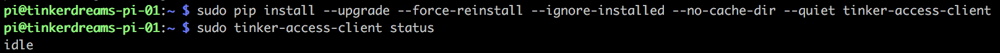

# tinker-access-client

The tinker-access-client is a [Raspberry Pi](https://www.raspberrypi.org/products/) based access control system that can be used to prevent unauthorized users from using devices that require special training, it could also conceivable be used to control electronic lock boxes, or doors.

The system was originally designed and created by [Matt Stallard](https://github.com/mstallard), [Ron Thomas](https://github.com/RonaldThomas), and [Matt Peopping](https://github.com/analogpixel) for [TinkerMill](http://www.tinkermill.org) a makerspace in [Longmont, CO](https://www.google.com/maps/place/Longmont,+CO/@40.1679379,-105.1678944,12z/data=!3m1!4b1!4m5!3m4!1s0x876bf908d5cc3349:0xc17da1eef3a32735!8m2!3d40.1672068!4d-105.1019275). It is continually being maintained and enhanced by other contributors in the community.

The client software is a [Python 2.7](https://www.python.org/download/releases/2.7/) service designed to run on the [Raspbian OS](https://www.raspberrypi.org/downloads/raspbian/). The service is responsible for coordinating activity between the RPi's peripherals (i.e. RFID reader, LCD, etc..) and the GPIO, as well as communicating with the [tinker-access-server](../tinker_access_server/README.md) for activity logging, authentication & authorization.

Official releases of the client software are packaged and published to [PyPI - the Python Package Index ](https://pypi.python.org/pypi/tinker-access-client/)

## Prerequisites:
1. Build the custom [Raspberry Pi HAT](https://www.raspberrypi.org/blog/introducing-raspberry-pi-hats/) as described [here](../docs/RFID_Wiring.pdf).

- Create a [Raspbian OS](https://www.raspberrypi.org/downloads/raspbian/) boot image as described [here](docs/bootimage.md).

- Transfer your SD card to the Raspberry Pi and boot it up.

- Create a remote secure shell to your Raspberry Pi. If you followed the previous setup instructions, your PI is already configured to allow SSH connections.  
[These](https://www.raspberrypi.org/documentation/remote-access/ssh/README.md) instructions may assist you in identifying the correct IP address and creating the connection.

- Follow [these](https://www.howtogeek.com/167195/how-to-change-your-raspberry-pi-or-other-linux-devices-hostname/) steps to change the hostname of your Raspberry Pi.

- Follow [these](https://www.raspberrypi.org/documentation/linux/usage/users.md) steps to update your the default password.

- Reboot the Raspberry Pi so that the changes take affect.

- Reconnect to the Raspberry Pi using your new hostname.

- Install the python package mamanager (a.k.a 'pip')

  **IMPORTANT**: If you have just created a new image using the previous mentioned guide, or you are using an existing image...

  Ensure you have the latest version of [pip](https://pip.pypa.io/en/stable) and its related setuptools installed, if you don't complete this step, you will almost certainly __not__ have a good time. Version issues with PIP and its related setuptools can be inconsistent, confusing and difficult to resolve, it is better to just avoid it now and ensure that they are updated.

  You can find references to many of these issues described [here](https://pip.pypa.io/en/stable/installing/#upgrading-pip)...

  This is what has worked for me consistently:
  ```commandline
  sudo apt-get update
  sudo apt-get install -U python-pip
  sudo easy_install -U pip
  ```

## Installing the tinker-access-client:

By default, the tinker-access-client is installed as a service that starts immediately, as well as upon reboot of the device.

Install the latest version of the client:

```commandline
sudo pip install --upgrade --force-reinstall \
--ignore-installed --no-cache-dir --quiet tinker-access-client
```

Query the client status. If all goes as planned, the expected output should be *'idle'*:

```commandline
sudo tinker-access-client status
```



If you didn't get the expected output, see the [troubleshooting guide](docs/troubleshooting.md).

See the [development guide](docs/development.md) for special installation instructions, best practices and other helpful information for maintaining & enhancing the code for the future.

## Using the tinker-access-client command-line tools:
The remaining information in this guide explains some ways to customize the behavior of the client, control the client, and/or get feedback about the state of the client
```
sudo tinker-access-client --help
```

TODO: explain configuration options...
